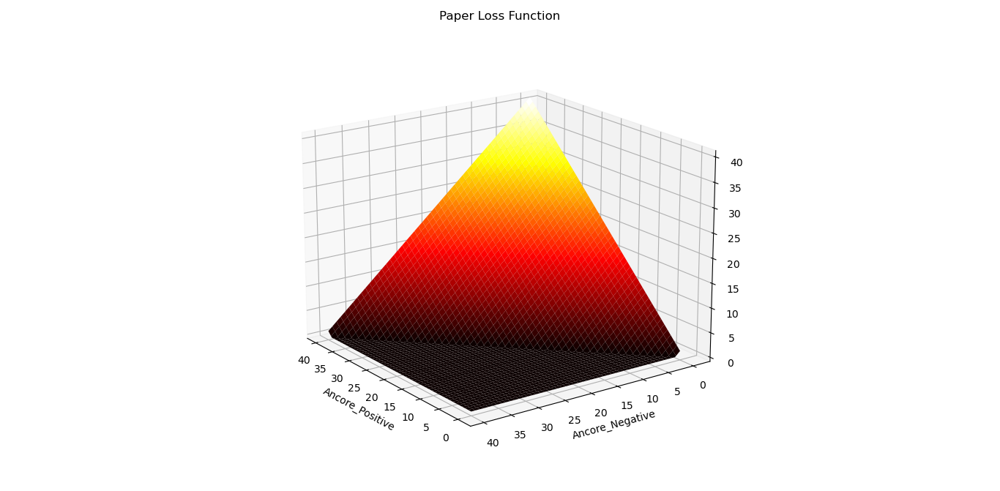

# Face_Recognition_From_Scratch

in that repository i have implement a facenet paper idea with an updat on triplet loss function for making it more robust as you well se that paper loss is very bad with small data as in power point graph

# Paper loss function visualizations
## paperloss function contour 

## paperloss function contour 

# Enhanced Loss function Visualization

## Enhanced Loss Contour

## Enhanced Loss Function

# Some results 
## Note
   distance is the distance between person and camera but distance between embedding iam sure its less than 0.01 but i am using 0.3 as my threshold

   

   ### img 2
   
